<h1 align="center"> E205 특화 프로젝트 </h1>

## 📝 목차

[프로젝트 개요](#item-one)

[역할 분담](#item-two)

[기술 스택](#item-three)

[데이터 베이스 모델링 (ERD)](#item-four)

[서비스 구현 화면](#item-five)

[느낀 점](#item-end)

## 프로젝트 개요

- <strong>진행 기간</strong>: 2023.08.21 ~ 2023.10.06

- <strong>목표</strong>
  
  - 개발자의 편의를 제공하는 채팅 서비스를 제공합니다.
  
  - 여러가지 툴을 사용하지 않고 하나의 채팅 서비스로 프로젝트를 원활하게 수행합니다.
  
  - 프로젝트 팀원들의 기여도를 확인하고 프로젝트와 관련된 통계 데이터를 제공합니다.

# 프로젝트 확인하기

## 역할 분담

#### <strong>이상훈</strong> - 팀장, 분산, BE : 분산 처리 / 서버 간 통신 / JIRA 관리

#### <strong>강동윤</strong> - BE : 웹 소켓 통신 / DB 관리 / 회원, 채팅 등

#### <strong>김성인</strong> - BE : 자동 배포 / ERD 설계 / 통계, 채팅방 등

#### <strong>김대웅</strong> - FE : 채팅 socket / 통계 그래프 / UX/UI

#### <strong>최상익</strong> - FE : API 통신 / 렌더링 개선 / UX/UI

#### <strong>이가영</strong> - FE : CSS / 리액트 개발 / UX/UI

<a id="item-three"></a> 

## 기술 스택

<a id="item-four"></a>

## **⚙** Management Tool

- 이슈관리 : JIRA

- 형상관리 : Gitlab

- 커뮤니케이션 : Notion, Mattermost

- 디자인 : Figma

- UCC : 모바비

## 💻 IDE

- VS Code : 1.18.1

- IntelliJ : 11.0.19

## 📱 Frontend

- React : ^18.2.0

- Vite : ^4.4.5

- react-router-dom : ^6.14.2

- recoil : ^0.7.7

- axios : ^1.4.0

- Node.js : 18.16.1

## 💾 Backend

- Springboot : 2.7.13

- Lombok

- Spring Data JPA

- Spring Data Redis(lecttuce)

- Spring Web

- Springdoc-openapi-ui 1.6.11

- Oauth2

- Swagger 3.0.0

- SSL

- CertBot(CA Certificates)

- SERVER : AWS EC2 Ubuntu 20.04.6 LTS

- DB : MySQL 8.0.33, Redis

- Hadoop : 3.3.5

- Spark : 3.4.1

## 🔃 DevOPS

- Nginx

- Docker

- Jenkins

## 데이터 베이스 모델링 (ERD)

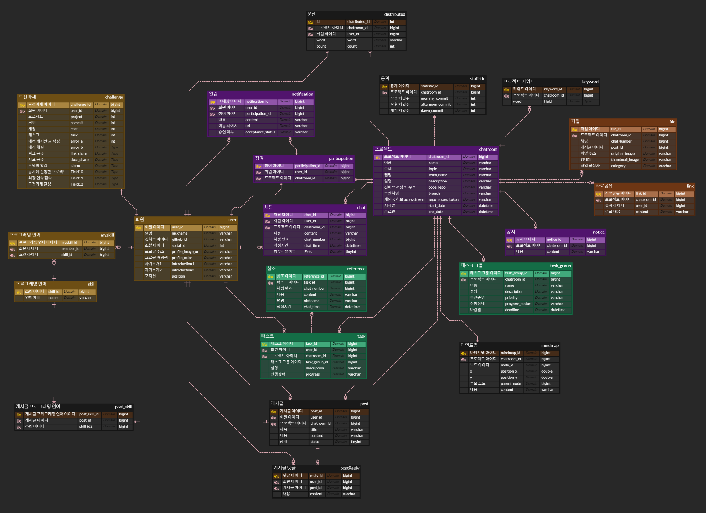

## 프로젝트 구조도

<details>
<summary>FrontEnd</summary>

```
📦src
 ┣ 📂components
 ┃ ┣ 📂analysis
 ┃ ┃ ┣ 📜Analysis.module.css
 ┃ ┃ ┣ 📜Analysis.tsx
 ┃ ┃ ┣ 📜BarChart.tsx
 ┃ ┃ ┣ 📜Cloud.tsx
 ┃ ┃ ┣ 📜Keywords.module.css
 ┃ ┃ ┣ 📜Keywords.tsx<details>
 ┃ ┃ ┣ 📜PiChart.tsx
 ┃ ┃ ┗ 📜RadarChart.tsx
 ┃ ┣ 📂common
 ┃ ┃ ┣ 📜ColorPickerDialog.tsx
 ┃ ┃ ┣ 📜Container.tsx
 ┃ ┃ ┣ 📜LeftSide.module.css
 ┃ ┃ ┣ 📜LeftSide.tsx
 ┃ ┃ ┣ 📜List.tsx
 ┃ ┃ ┣ 📜ProfileImgBox.tsx
 ┃ ┃ ┣ 📜Slick.tsx
 ┃ ┃ ┗ 📜StyledBadge.ts
 ┃ ┣ 📂common2
 ┃ ┃ ┣ 📜IndivChatModal.module.css
 ┃ ┃ ┣ 📜IndivChatModal.tsx
 ┃ ┃ ┣ 📜IndivTask.css
 ┃ ┃ ┣ 📜IndivTask.module.css
 ┃ ┃ ┣ 📜IndivTask.tsx
 ┃ ┃ ┣ 📜TaskModal.module.css
 ┃ ┃ ┣ 📜TaskModal.tsx
 ┃ ┃ ┣ 📜TeamTask.module.css
 ┃ ┃ ┣ 📜TeamTask.tsx
 ┃ ┃ ┣ 📜TeamTaskCreateModal.module.css
 ┃ ┃ ┗ 📜TeamTaskCreateModal.tsx
 ┃ ┣ 📂createproject
 ┃ ┃ ┣ 📜CreateProject.module.css
 ┃ ┃ ┣ 📜CreateProject.tsx
 ┃ ┃ ┣ 📜ItemTypes.tsx
 ┃ ┃ ┣ 📜Nemo.tsx
 ┃ ┃ ┣ 📜SetDate.module.css
 ┃ ┃ ┣ 📜SetDate.tsx
 ┃ ┃ ┣ 📜SetGitRepo.module.css
 ┃ ┃ ┣ 📜SetGitRepo.tsx
 ┃ ┃ ┣ 📜SetMember.module.css
 ┃ ┃ ┣ 📜SetMember.tsx
 ┃ ┃ ┣ 📜SetProjectInfo.module.css
 ┃ ┃ ┣ 📜SetProjectInfo.tsx
 ┃ ┃ ┣ 📜SetProjectName.module.css
 ┃ ┃ ┗ 📜SetProjectName.tsx
 ┃ ┣ 📂error
 ┃ ┃ ┣ 📜Error.css
 ┃ ┃ ┣ 📜Error.module.css
 ┃ ┃ ┣ 📜ErrorBoard.tsx
 ┃ ┃ ┣ 📜ErrorCard.tsx
 ┃ ┃ ┣ 📜ErrorCreate.tsx
 ┃ ┃ ┣ 📜ErrorList.tsx
 ┃ ┃ ┣ 📜ErrorModal.module.css
 ┃ ┃ ┣ 📜ErrortModal.tsx
 ┃ ┃ ┣ 📜MultiSelect.tsx
 ┃ ┃ ┗ 📜Search.tsx
 ┃ ┣ 📂idea
 ┃ ┃ ┣ 📜Idea.module.css
 ┃ ┃ ┣ 📜Idea.tsx
 ┃ ┃ ┣ 📜MindMapEdge.tsx
 ┃ ┃ ┣ 📜MindMapNode.tsx
 ┃ ┃ ┣ 📜Share.module.css
 ┃ ┃ ┗ 📜Share.tsx
 ┃ ┣ 📂login
 ┃ ┃ ┣ 📜landing1.png
 ┃ ┃ ┣ 📜landing2.png
 ┃ ┃ ┣ 📜Login.module.css
 ┃ ┃ ┗ 📜Login.tsx
 ┃ ┣ 📂main
 ┃ ┃ ┣ 📜invite.module.css
 ┃ ┃ ┣ 📜Invite.tsx
 ┃ ┃ ┣ 📜InviteCard.tsx
 ┃ ┃ ┣ 📜Project.module.css
 ┃ ┃ ┣ 📜Project.tsx
 ┃ ┃ ┣ 📜ProjectCard.module.css
 ┃ ┃ ┣ 📜ProjectCard.tsx
 ┃ ┃ ┣ 📜ProjectModal.module.css
 ┃ ┃ ┣ 📜ProjectModal.tsx
 ┃ ┃ ┗ 📜ProjectSlide.tsx
 ┃ ┣ 📂message
 ┃ ┃ ┣ 📜CreateLinkModal.tsx
 ┃ ┃ ┣ 📜GoogleSearch.tsx
 ┃ ┃ ┣ 📜ItemTypes.ts
 ┃ ┃ ┣ 📜LinkOGItem.module.css
 ┃ ┃ ┣ 📜LinkOGItem.tsx
 ┃ ┃ ┣ 📜Message.module.css
 ┃ ┃ ┣ 📜Message.tsx
 ┃ ┃ ┣ 📜MessageBack.tsx
 ┃ ┃ ┣ 📜MessageItem.module.css
 ┃ ┃ ┣ 📜MessageItem.tsx
 ┃ ┃ ┣ 📜MessageLeftBody.module.css
 ┃ ┃ ┣ 📜MessageLeftBody.tsx
 ┃ ┃ ┣ 📜MessageRightBody.module.css
 ┃ ┃ ┣ 📜MessageRightBody.tsx
 ┃ ┃ ┣ 📜RightFileTab.module.css
 ┃ ┃ ┣ 📜RightFileTab.tsx
 ┃ ┃ ┣ 📜RightLinkTab.module.css
 ┃ ┃ ┣ 📜RightLinkTab.tsx
 ┃ ┃ ┣ 📜RightMediaTab.module.css
 ┃ ┃ ┣ 📜RightMediaTab.tsx
 ┃ ┃ ┣ 📜RightSearchTab.module.css
 ┃ ┃ ┗ 📜RightSearchTab.tsx
 ┃ ┣ 📂profile
 ┃ ┃ ┣ 📜ProfileLarge.tsx
 ┃ ┃ ┣ 📜ProfileMedium.tsx
 ┃ ┃ ┗ 📜ProfileSmall.tsx
 ┃ ┣ 📂profileSetting
 ┃ ┃ ┣ 📜CustomProfile.module.css
 ┃ ┃ ┣ 📜CustomProfile.tsx
 ┃ ┃ ┣ 📜CustomProfileInfo.module.css
 ┃ ┃ ┗ 📜CustomProfileInfo.tsx
 ┃ ┗ 📂reactDnd
 ┃ ┃ ┣ 📜Column.module.css
 ┃ ┃ ┣ 📜Column.tsx
 ┃ ┃ ┣ 📜Contants.tsx
 ┃ ┃ ┣ 📜MovableItem.module.css
 ┃ ┃ ┣ 📜MovableItem.tsx
 ┃ ┃ ┣ 📜Tasks.tsx
 ┃ ┃ ┗ 📜Types.tsx
 ┣ 📂pages
 ┃ ┣ 📜AnalysisPage.tsx
 ┃ ┣ 📜CreateProjectPage.module.css
 ┃ ┣ 📜CreateProjectPage.tsx
 ┃ ┣ 📜CustomProfilePage.tsx
 ┃ ┣ 📜IdeaPage.module.css
 ┃ ┣ 📜IdeaPage.tsx
 ┃ ┣ 📜LoginPage.tsx
 ┃ ┣ 📜MainPage.module.css
 ┃ ┣ 📜MainPage.tsx
 ┃ ┣ 📜MessagePage.module.css
 ┃ ┣ 📜MessagePage.tsx
 ┃ ┣ 📜ProfilePage.module.css
 ┃ ┣ 📜ProfilePage.tsx
 ┃ ┣ 📜RedirectPage.tsx
 ┃ ┣ 📜TaskPage.tsx
 ┃ ┗ 📜UserLoginPage.tsx
 ┣ 📂stores
 ┃ ┣ 📜atom.ts
 ┃ ┣ 📜linkState.ts
 ┃ ┗ 📜selecter.ts
 ┣ 📂utils
 ┃ ┣ 📜analysisApi.ts
 ┃ ┣ 📜api.tsx
 ┃ ┣ 📜chatApi.tsx
 ┃ ┣ 📜ChatList.js
 ┃ ┣ 📜errorApi.ts
 ┃ ┣ 📜ideaApi.ts
 ┃ ┣ 📜invitationApi.ts
 ┃ ┣ 📜linkApi.ts
 ┃ ┣ 📜mindmapApi.ts
 ┃ ┣ 📜projectApi.tsx
 ┃ ┣ 📜taskApi.tsx
 ┃ ┣ 📜taskGroupApi.tsx
 ┃ ┣ 📜taskReferenceApi.tsx
 ┃ ┗ 📜userApi.tsx
 ┣ 📜App.css
 ┣ 📜App.test.tsx
 ┣ 📜App.tsx
 ┣ 📜AppRouter.tsx
 ┣ 📜index.css
 ┣ 📜index.tsx
 ┣ 📜logo.svg
 ┣ 📜react-app-env.d.ts
 ┣ 📜reportWebVitals.ts
 ┣ 📜setupProxy.js
 ┣ 📜setupTests.ts
 ┗ 📜store.ts
```

</details>

<details>
<summary>back-end</summary>

```
📦src
 ┣ 📂main
 ┃ ┣ 📂java
 ┃ ┃ ┗ 📂com
 ┃ ┃ ┃ ┗ 📂ssafy
 ┃ ┃ ┃ ┃ ┗ 📂backend
 ┃ ┃ ┃ ┃ ┃ ┣ 📂domain
 ┃ ┃ ┃ ┃ ┃ ┃ ┣ 📂analyze
 ┃ ┃ ┃ ┃ ┃ ┃ ┃ ┣ 📂controller
 ┃ ┃ ┃ ┃ ┃ ┃ ┃ ┃ ┣ 📜AnalyzeController.java
 ┃ ┃ ┃ ┃ ┃ ┃ ┃ ┃ ┗ 📜KeywordController.java
 ┃ ┃ ┃ ┃ ┃ ┃ ┃ ┣ 📂dto
 ┃ ┃ ┃ ┃ ┃ ┃ ┃ ┃ ┣ 📜KeywordsRequest.java
 ┃ ┃ ┃ ┃ ┃ ┃ ┃ ┃ ┣ 📜MyKeywords.java
 ┃ ┃ ┃ ┃ ┃ ┃ ┃ ┃ ┗ 📜ProjectStatistic.java
 ┃ ┃ ┃ ┃ ┃ ┃ ┃ ┣ 📂repository
 ┃ ┃ ┃ ┃ ┃ ┃ ┃ ┃ ┣ 📜KeywordRepository.java
 ┃ ┃ ┃ ┃ ┃ ┃ ┃ ┃ ┗ 📜StatisticRepository.java
 ┃ ┃ ┃ ┃ ┃ ┃ ┃ ┣ 📂service
 ┃ ┃ ┃ ┃ ┃ ┃ ┃ ┃ ┣ 📜KeywordService.java
 ┃ ┃ ┃ ┃ ┃ ┃ ┃ ┃ ┗ 📜StatisticService.java
 ┃ ┃ ┃ ┃ ┃ ┃ ┃ ┣ 📜Keyword.java
 ┃ ┃ ┃ ┃ ┃ ┃ ┃ ┗ 📜Statistic.java
 ┃ ┃ ┃ ┃ ┃ ┃ ┣ 📂attachedFile
 ┃ ┃ ┃ ┃ ┃ ┃ ┃ ┣ 📂controller
 ┃ ┃ ┃ ┃ ┃ ┃ ┃ ┃ ┗ 📜AttachedFileController.java
 ┃ ┃ ┃ ┃ ┃ ┃ ┃ ┣ 📂dto
 ┃ ┃ ┃ ┃ ┃ ┃ ┃ ┃ ┗ 📜AttachedFileInfo.java
 ┃ ┃ ┃ ┃ ┃ ┃ ┃ ┣ 📂repository
 ┃ ┃ ┃ ┃ ┃ ┃ ┃ ┃ ┗ 📜AttachedFileRepository.java
 ┃ ┃ ┃ ┃ ┃ ┃ ┃ ┣ 📂service
 ┃ ┃ ┃ ┃ ┃ ┃ ┃ ┃ ┗ 📜AttachedFileService.java
 ┃ ┃ ┃ ┃ ┃ ┃ ┃ ┣ 📜AttachedFile.java
 ┃ ┃ ┃ ┃ ┃ ┃ ┃ ┗ 📜Category.java
 ┃ ┃ ┃ ┃ ┃ ┃ ┣ 📂chat
 ┃ ┃ ┃ ┃ ┃ ┃ ┃ ┣ 📂controller
 ┃ ┃ ┃ ┃ ┃ ┃ ┃ ┃ ┣ 📜ChatController.java
 ┃ ┃ ┃ ┃ ┃ ┃ ┃ ┃ ┣ 📜ChatRoomController.java
 ┃ ┃ ┃ ┃ ┃ ┃ ┃ ┃ ┣ 📜ChatSchedulerContoller.java
 ┃ ┃ ┃ ┃ ┃ ┃ ┃ ┃ ┣ 📜InvitationController.java
 ┃ ┃ ┃ ┃ ┃ ┃ ┃ ┃ ┣ 📜NoticeController.java
 ┃ ┃ ┃ ┃ ┃ ┃ ┃ ┃ ┗ 📜NotificationController.java
 ┃ ┃ ┃ ┃ ┃ ┃ ┃ ┣ 📂dto
 ┃ ┃ ┃ ┃ ┃ ┃ ┃ ┃ ┣ 📜ChatInfo.java
 ┃ ┃ ┃ ┃ ┃ ┃ ┃ ┃ ┣ 📜ChatInfoResponse.java
 ┃ ┃ ┃ ┃ ┃ ┃ ┃ ┃ ┣ 📜ChatPost.java
 ┃ ┃ ┃ ┃ ┃ ┃ ┃ ┃ ┣ 📜ChatResponse.java
 ┃ ┃ ┃ ┃ ┃ ┃ ┃ ┃ ┣ 📜ChatRoomInfo.java
 ┃ ┃ ┃ ┃ ┃ ┃ ┃ ┃ ┣ 📜ChatRoomInfoDetailResponse.java
 ┃ ┃ ┃ ┃ ┃ ┃ ┃ ┃ ┣ 📜ChatRoomInfoResponse.java
 ┃ ┃ ┃ ┃ ┃ ┃ ┃ ┃ ┣ 📜ChatRoomUserInfoResponse.java
 ┃ ┃ ┃ ┃ ┃ ┃ ┃ ┃ ┣ 📜ChatWordDto.java
 ┃ ┃ ┃ ┃ ┃ ┃ ┃ ┃ ┣ 📜MyInvitationResponse.java
 ┃ ┃ ┃ ┃ ┃ ┃ ┃ ┃ ┣ 📜NoticeContent.java
 ┃ ┃ ┃ ┃ ┃ ┃ ┃ ┃ ┗ 📜NotificationResponse.java
 ┃ ┃ ┃ ┃ ┃ ┃ ┃ ┣ 📂entity
 ┃ ┃ ┃ ┃ ┃ ┃ ┃ ┃ ┣ 📜AcceptanceStatus.java
 ┃ ┃ ┃ ┃ ┃ ┃ ┃ ┃ ┣ 📜Chat.java
 ┃ ┃ ┃ ┃ ┃ ┃ ┃ ┃ ┣ 📜ChatRoom.java
 ┃ ┃ ┃ ┃ ┃ ┃ ┃ ┃ ┣ 📜Distributed.java
 ┃ ┃ ┃ ┃ ┃ ┃ ┃ ┃ ┣ 📜Notice.java
 ┃ ┃ ┃ ┃ ┃ ┃ ┃ ┃ ┣ 📜Notification.java
 ┃ ┃ ┃ ┃ ┃ ┃ ┃ ┃ ┣ 📜NotificationType.java
 ┃ ┃ ┃ ┃ ┃ ┃ ┃ ┃ ┗ 📜Participation.java
 ┃ ┃ ┃ ┃ ┃ ┃ ┃ ┣ 📂repository
 ┃ ┃ ┃ ┃ ┃ ┃ ┃ ┃ ┣ 📜ChatRepository.java
 ┃ ┃ ┃ ┃ ┃ ┃ ┃ ┃ ┣ 📜ChatRoomRepository.java
 ┃ ┃ ┃ ┃ ┃ ┃ ┃ ┃ ┣ 📜DistributedRepository.java
 ┃ ┃ ┃ ┃ ┃ ┃ ┃ ┃ ┣ 📜EmitterRepository.java
 ┃ ┃ ┃ ┃ ┃ ┃ ┃ ┃ ┣ 📜EmitterRepositoryImpl.java
 ┃ ┃ ┃ ┃ ┃ ┃ ┃ ┃ ┣ 📜NoticeRepository.java
 ┃ ┃ ┃ ┃ ┃ ┃ ┃ ┃ ┣ 📜NotificationRepository.java
 ┃ ┃ ┃ ┃ ┃ ┃ ┃ ┃ ┗ 📜ParticipationRepository.java
 ┃ ┃ ┃ ┃ ┃ ┃ ┃ ┗ 📂service
 ┃ ┃ ┃ ┃ ┃ ┃ ┃ ┃ ┣ 📜ChatRoomService.java
 ┃ ┃ ┃ ┃ ┃ ┃ ┃ ┃ ┣ 📜ChatScheduler.java
 ┃ ┃ ┃ ┃ ┃ ┃ ┃ ┃ ┣ 📜ChatService.java
 ┃ ┃ ┃ ┃ ┃ ┃ ┃ ┃ ┣ 📜InvitationService.java
 ┃ ┃ ┃ ┃ ┃ ┃ ┃ ┃ ┣ 📜NoticeService.java
 ┃ ┃ ┃ ┃ ┃ ┃ ┃ ┃ ┗ 📜NotificationService.java
 ┃ ┃ ┃ ┃ ┃ ┃ ┣ 📂common
 ┃ ┃ ┃ ┃ ┃ ┃ ┃ ┣ 📂advice
 ┃ ┃ ┃ ┃ ┃ ┃ ┃ ┃ ┗ 📜ExceptionAdvice.java
 ┃ ┃ ┃ ┃ ┃ ┃ ┃ ┣ 📂exception
 ┃ ┃ ┃ ┃ ┃ ┃ ┃ ┃ ┗ 📜ResourceNotFoundException.java
 ┃ ┃ ┃ ┃ ┃ ┃ ┃ ┣ 📜BaseEntity.java
 ┃ ┃ ┃ ┃ ┃ ┃ ┃ ┣ 📜BasicResponse.java
 ┃ ┃ ┃ ┃ ┃ ┃ ┃ ┣ 📜FileUploadResponse.java
 ┃ ┃ ┃ ┃ ┃ ┃ ┃ ┗ 📜GlobalMethod.java
 ┃ ┃ ┃ ┃ ┃ ┃ ┣ 📂link
 ┃ ┃ ┃ ┃ ┃ ┃ ┃ ┣ 📂controller
 ┃ ┃ ┃ ┃ ┃ ┃ ┃ ┃ ┗ 📜LinkController.java
 ┃ ┃ ┃ ┃ ┃ ┃ ┃ ┣ 📂dto
 ┃ ┃ ┃ ┃ ┃ ┃ ┃ ┃ ┣ 📜LinkInfo.java
 ┃ ┃ ┃ ┃ ┃ ┃ ┃ ┃ ┗ 📜LinkInfoResponse.java
 ┃ ┃ ┃ ┃ ┃ ┃ ┃ ┣ 📂repository
 ┃ ┃ ┃ ┃ ┃ ┃ ┃ ┃ ┗ 📜LinkRepository.java
 ┃ ┃ ┃ ┃ ┃ ┃ ┃ ┣ 📂service
 ┃ ┃ ┃ ┃ ┃ ┃ ┃ ┃ ┗ 📜LinkService.java
 ┃ ┃ ┃ ┃ ┃ ┃ ┃ ┗ 📜Link.java
 ┃ ┃ ┃ ┃ ┃ ┃ ┣ 📂mindmap
 ┃ ┃ ┃ ┃ ┃ ┃ ┃ ┣ 📂controller
 ┃ ┃ ┃ ┃ ┃ ┃ ┃ ┃ ┗ 📜MindMapController.java
 ┃ ┃ ┃ ┃ ┃ ┃ ┃ ┣ 📂dto
 ┃ ┃ ┃ ┃ ┃ ┃ ┃ ┃ ┗ 📜MindMapNodeInfo.java
 ┃ ┃ ┃ ┃ ┃ ┃ ┃ ┣ 📂repository
 ┃ ┃ ┃ ┃ ┃ ┃ ┃ ┃ ┗ 📜MindMapRepository.java
 ┃ ┃ ┃ ┃ ┃ ┃ ┃ ┣ 📂service
 ┃ ┃ ┃ ┃ ┃ ┃ ┃ ┃ ┗ 📜MindMapService.java
 ┃ ┃ ┃ ┃ ┃ ┃ ┃ ┗ 📜MindMap.java
 ┃ ┃ ┃ ┃ ┃ ┃ ┣ 📂post
 ┃ ┃ ┃ ┃ ┃ ┃ ┃ ┣ 📂controller
 ┃ ┃ ┃ ┃ ┃ ┃ ┃ ┃ ┣ 📜PostController.java
 ┃ ┃ ┃ ┃ ┃ ┃ ┃ ┃ ┗ 📜ReplyController.java
 ┃ ┃ ┃ ┃ ┃ ┃ ┃ ┣ 📂dto
 ┃ ┃ ┃ ┃ ┃ ┃ ┃ ┃ ┣ 📜PostInfo.java
 ┃ ┃ ┃ ┃ ┃ ┃ ┃ ┃ ┣ 📜PostInfoDetailResponse.java
 ┃ ┃ ┃ ┃ ┃ ┃ ┃ ┃ ┣ 📜PostInfoResponse.java
 ┃ ┃ ┃ ┃ ┃ ┃ ┃ ┃ ┣ 📜ReplyInfo.java
 ┃ ┃ ┃ ┃ ┃ ┃ ┃ ┃ ┗ 📜ReplyInfoResponse.java
 ┃ ┃ ┃ ┃ ┃ ┃ ┃ ┣ 📂repository
 ┃ ┃ ┃ ┃ ┃ ┃ ┃ ┃ ┣ 📜PostRepository.java
 ┃ ┃ ┃ ┃ ┃ ┃ ┃ ┃ ┣ 📜PostSkillRepository.java
 ┃ ┃ ┃ ┃ ┃ ┃ ┃ ┃ ┗ 📜ReplyRepository.java
 ┃ ┃ ┃ ┃ ┃ ┃ ┃ ┣ 📂service
 ┃ ┃ ┃ ┃ ┃ ┃ ┃ ┃ ┣ 📜PostService.java
 ┃ ┃ ┃ ┃ ┃ ┃ ┃ ┃ ┗ 📜ReplyService.java
 ┃ ┃ ┃ ┃ ┃ ┃ ┃ ┣ 📜Post.java
 ┃ ┃ ┃ ┃ ┃ ┃ ┃ ┣ 📜PostSkill.java
 ┃ ┃ ┃ ┃ ┃ ┃ ┃ ┗ 📜Reply.java
 ┃ ┃ ┃ ┃ ┃ ┃ ┣ 📂task
 ┃ ┃ ┃ ┃ ┃ ┃ ┃ ┣ 📂controller
 ┃ ┃ ┃ ┃ ┃ ┃ ┃ ┃ ┣ 📜ReferenceController.java
 ┃ ┃ ┃ ┃ ┃ ┃ ┃ ┃ ┣ 📜TaskController.java
 ┃ ┃ ┃ ┃ ┃ ┃ ┃ ┃ ┗ 📜TaskGroupController.java
 ┃ ┃ ┃ ┃ ┃ ┃ ┃ ┣ 📂dto
 ┃ ┃ ┃ ┃ ┃ ┃ ┃ ┃ ┣ 📜ReferenceChatInfo.java
 ┃ ┃ ┃ ┃ ┃ ┃ ┃ ┃ ┣ 📜ReferenceInfo.java
 ┃ ┃ ┃ ┃ ┃ ┃ ┃ ┃ ┣ 📜ReferenceInfoResponse.java
 ┃ ┃ ┃ ┃ ┃ ┃ ┃ ┃ ┣ 📜TaskGroupInfo.java
 ┃ ┃ ┃ ┃ ┃ ┃ ┃ ┃ ┣ 📜TaskGroupInfoDetailResponse.java
 ┃ ┃ ┃ ┃ ┃ ┃ ┃ ┃ ┣ 📜TaskGroupInfoResponse.java
 ┃ ┃ ┃ ┃ ┃ ┃ ┃ ┃ ┣ 📜TaskGroupRegister.java
 ┃ ┃ ┃ ┃ ┃ ┃ ┃ ┃ ┣ 📜TaskInfo.java
 ┃ ┃ ┃ ┃ ┃ ┃ ┃ ┃ ┣ 📜TaskInfoDetailResponse.java
 ┃ ┃ ┃ ┃ ┃ ┃ ┃ ┃ ┣ 📜TaskInfoResponse.java
 ┃ ┃ ┃ ┃ ┃ ┃ ┃ ┃ ┗ 📜TaskRegister.java
 ┃ ┃ ┃ ┃ ┃ ┃ ┃ ┣ 📂repository
 ┃ ┃ ┃ ┃ ┃ ┃ ┃ ┃ ┣ 📜ReferenceRepository.java
 ┃ ┃ ┃ ┃ ┃ ┃ ┃ ┃ ┣ 📜TaskGroupRepository.java
 ┃ ┃ ┃ ┃ ┃ ┃ ┃ ┃ ┗ 📜TaskRepository.java
 ┃ ┃ ┃ ┃ ┃ ┃ ┃ ┣ 📂service
 ┃ ┃ ┃ ┃ ┃ ┃ ┃ ┃ ┣ 📜ReferenceService.java
 ┃ ┃ ┃ ┃ ┃ ┃ ┃ ┃ ┣ 📜TaskGroupService.java
 ┃ ┃ ┃ ┃ ┃ ┃ ┃ ┃ ┗ 📜TaskService.java
 ┃ ┃ ┃ ┃ ┃ ┃ ┃ ┣ 📜Priority.java
 ┃ ┃ ┃ ┃ ┃ ┃ ┃ ┣ 📜Progress.java
 ┃ ┃ ┃ ┃ ┃ ┃ ┃ ┣ 📜Reference.java
 ┃ ┃ ┃ ┃ ┃ ┃ ┃ ┣ 📜Task.java
 ┃ ┃ ┃ ┃ ┃ ┃ ┃ ┗ 📜TaskGroup.java
 ┃ ┃ ┃ ┃ ┃ ┃ ┗ 📂user
 ┃ ┃ ┃ ┃ ┃ ┃ ┃ ┣ 📂controller
 ┃ ┃ ┃ ┃ ┃ ┃ ┃ ┃ ┣ 📜SkillController.java
 ┃ ┃ ┃ ┃ ┃ ┃ ┃ ┃ ┗ 📜UserController.java
 ┃ ┃ ┃ ┃ ┃ ┃ ┃ ┣ 📂dto
 ┃ ┃ ┃ ┃ ┃ ┃ ┃ ┃ ┣ 📜ChallengeInfoResponse.java
 ┃ ┃ ┃ ┃ ┃ ┃ ┃ ┃ ┣ 📜MySkillInfo.java
 ┃ ┃ ┃ ┃ ┃ ┃ ┃ ┃ ┣ 📜SearchUser.java
 ┃ ┃ ┃ ┃ ┃ ┃ ┃ ┃ ┣ 📜SkillInfoResponse.java
 ┃ ┃ ┃ ┃ ┃ ┃ ┃ ┃ ┣ 📜UserDto.java
 ┃ ┃ ┃ ┃ ┃ ┃ ┃ ┃ ┣ 📜UserInfo.java
 ┃ ┃ ┃ ┃ ┃ ┃ ┃ ┃ ┗ 📜UserInfoResponse.java
 ┃ ┃ ┃ ┃ ┃ ┃ ┃ ┣ 📂exception
 ┃ ┃ ┃ ┃ ┃ ┃ ┃ ┃ ┣ 📜AuthenticationNotValidException.java
 ┃ ┃ ┃ ┃ ┃ ┃ ┃ ┃ ┗ 📜UserNotFoundException.java
 ┃ ┃ ┃ ┃ ┃ ┃ ┃ ┣ 📂repository
 ┃ ┃ ┃ ┃ ┃ ┃ ┃ ┃ ┣ 📜ChallengeRepository.java
 ┃ ┃ ┃ ┃ ┃ ┃ ┃ ┃ ┣ 📜MySkillRepository.java
 ┃ ┃ ┃ ┃ ┃ ┃ ┃ ┃ ┣ 📜SkillRepository.java
 ┃ ┃ ┃ ┃ ┃ ┃ ┃ ┃ ┗ 📜UserRepository.java
 ┃ ┃ ┃ ┃ ┃ ┃ ┃ ┣ 📂service
 ┃ ┃ ┃ ┃ ┃ ┃ ┃ ┃ ┣ 📜ChallengeService.java
 ┃ ┃ ┃ ┃ ┃ ┃ ┃ ┃ ┣ 📜SkillService.java
 ┃ ┃ ┃ ┃ ┃ ┃ ┃ ┃ ┗ 📜UserService.java
 ┃ ┃ ┃ ┃ ┃ ┃ ┃ ┣ 📜Challenge.java
 ┃ ┃ ┃ ┃ ┃ ┃ ┃ ┣ 📜MySkill.java
 ┃ ┃ ┃ ┃ ┃ ┃ ┃ ┣ 📜Role.java
 ┃ ┃ ┃ ┃ ┃ ┃ ┃ ┣ 📜Skill.java
 ┃ ┃ ┃ ┃ ┃ ┃ ┃ ┣ 📜State.java
 ┃ ┃ ┃ ┃ ┃ ┃ ┃ ┗ 📜User.java
 ┃ ┃ ┃ ┃ ┃ ┣ 📂global
 ┃ ┃ ┃ ┃ ┃ ┃ ┣ 📂config
 ┃ ┃ ┃ ┃ ┃ ┃ ┃ ┣ 📜RedisConfig.java
 ┃ ┃ ┃ ┃ ┃ ┃ ┃ ┣ 📜ScheduledConfig.java
 ┃ ┃ ┃ ┃ ┃ ┃ ┃ ┣ 📜SecurityConfig.java
 ┃ ┃ ┃ ┃ ┃ ┃ ┃ ┣ 📜SwaggerConfig.java
 ┃ ┃ ┃ ┃ ┃ ┃ ┃ ┣ 📜WebConfig.java
 ┃ ┃ ┃ ┃ ┃ ┃ ┃ ┗ 📜WebSocketConfig.java
 ┃ ┃ ┃ ┃ ┃ ┃ ┣ 📂github
 ┃ ┃ ┃ ┃ ┃ ┃ ┃ ┣ 📂dto
 ┃ ┃ ┃ ┃ ┃ ┃ ┃ ┃ ┗ 📜repositoryInfo.java
 ┃ ┃ ┃ ┃ ┃ ┃ ┃ ┣ 📜GithubApi.java
 ┃ ┃ ┃ ┃ ┃ ┃ ┃ ┗ 📜GithubScheduler.java
 ┃ ┃ ┃ ┃ ┃ ┃ ┗ 📂jwt
 ┃ ┃ ┃ ┃ ┃ ┃ ┃ ┣ 📂filter
 ┃ ┃ ┃ ┃ ┃ ┃ ┃ ┃ ┗ 📜JwtAuthenticationProcessingFilter.java
 ┃ ┃ ┃ ┃ ┃ ┃ ┃ ┣ 📂service
 ┃ ┃ ┃ ┃ ┃ ┃ ┃ ┃ ┗ 📜JwtService.java
 ┃ ┃ ┃ ┃ ┃ ┃ ┃ ┗ 📂util
 ┃ ┃ ┃ ┃ ┃ ┃ ┃ ┃ ┗ 📜PasswordUtil.java
 ┃ ┃ ┃ ┃ ┃ ┣ 📂oauth2
 ┃ ┃ ┃ ┃ ┃ ┃ ┣ 📂service
 ┃ ┃ ┃ ┃ ┃ ┃ ┃ ┗ 📜CustomOAuth2UserService.java
 ┃ ┃ ┃ ┃ ┃ ┃ ┣ 📂userinfo
 ┃ ┃ ┃ ┃ ┃ ┃ ┃ ┗ 📜OAuth2UserInfo.java
 ┃ ┃ ┃ ┃ ┃ ┃ ┣ 📜CustomOAuth2User.java
 ┃ ┃ ┃ ┃ ┃ ┃ ┣ 📜OAuth2Attribute.java
 ┃ ┃ ┃ ┃ ┃ ┃ ┣ 📜OAuth2LoginFailureHandler.java
 ┃ ┃ ┃ ┃ ┃ ┃ ┗ 📜OAuth2LoginSuccessHandler.java
 ┃ ┃ ┃ ┃ ┃ ┗ 📜BackendApplication.java
 ┃ ┗ 📂resources
 ┃ ┃ ┣ 📂static
 ┃ ┃ ┃ ┣ 📜app.js
 ┃ ┃ ┃ ┗ 📜index.html
 ┃ ┃ ┗ 📜application.yml
 ┗ 📂test
 ┃ ┗ 📂java
 ┃ ┃ ┗ 📂com
 ┃ ┃ ┃ ┗ 📂ssafy
 ┃ ┃ ┃ ┃ ┗ 📂backend
 ┃ ┃ ┃ ┃ ┃ ┗ 📜BackendApplicationTests.java
```

</details>

## 서비스 구현 화면

### 1. 로그인 및 커스텀

- 신규 회원 가입 및 커스텀

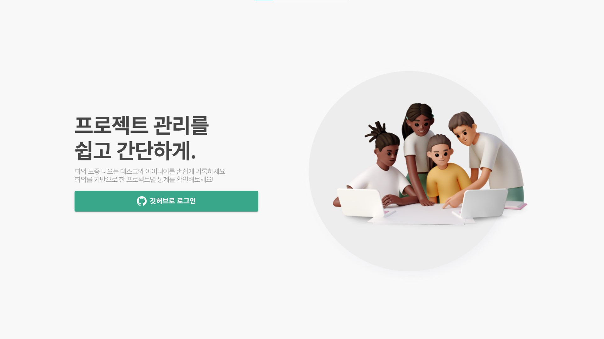

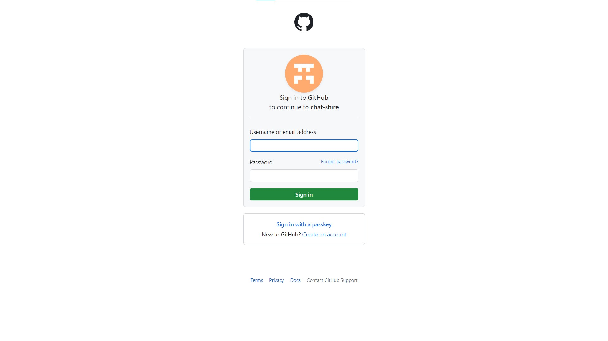

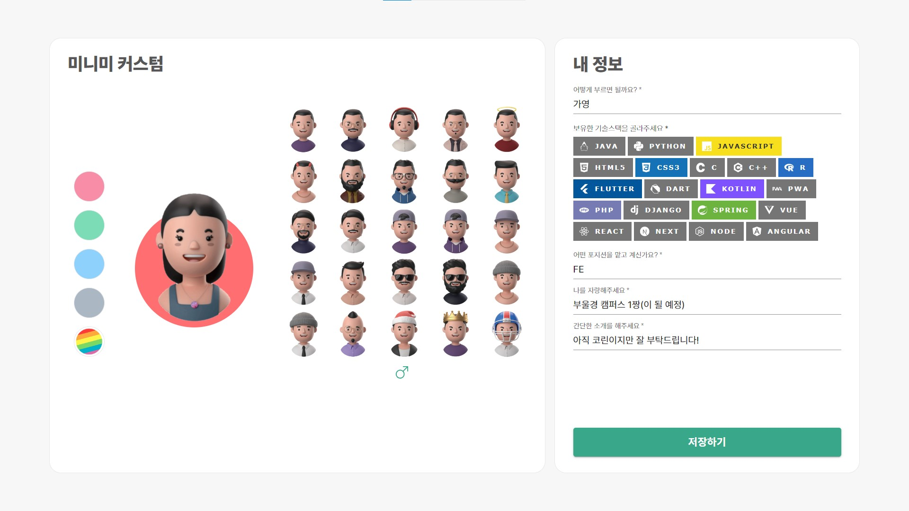

- 기존 회원 로그인

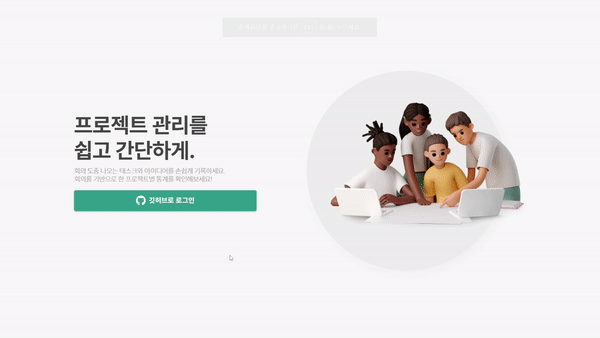

### 2. 내 정보 확인 및 커스텀

- 분산 처리한 내용 및 도전과제 보여줌

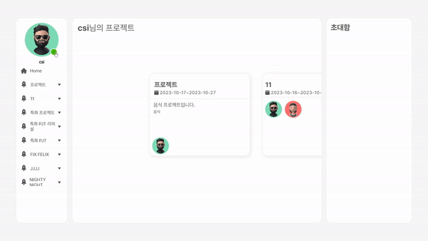

- 커스텀 변경

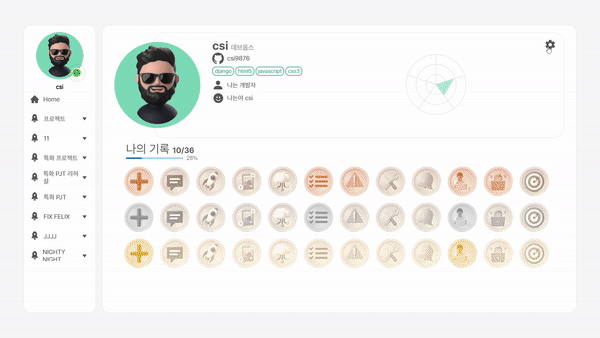

- 유저 상태 변경

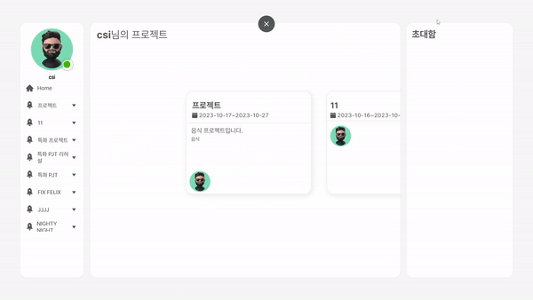

### 3. 메인 페이지에서 프로젝트 생성

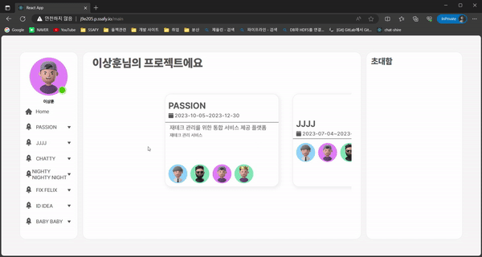

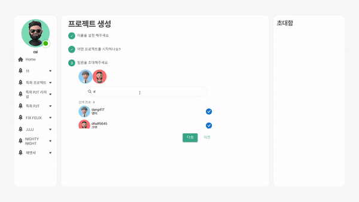

### 4. 채팅창 기능 소개

- 채팅 입력 ( 채팅, 이모지, 사진, 파일, 동영상)


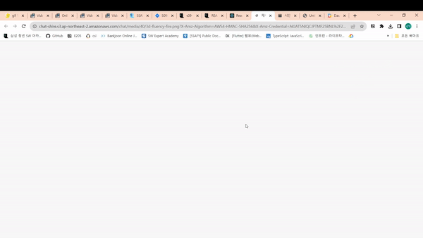

- 이미지&동영상 탭, 파일 탭, 링크 탭, 검색 탭

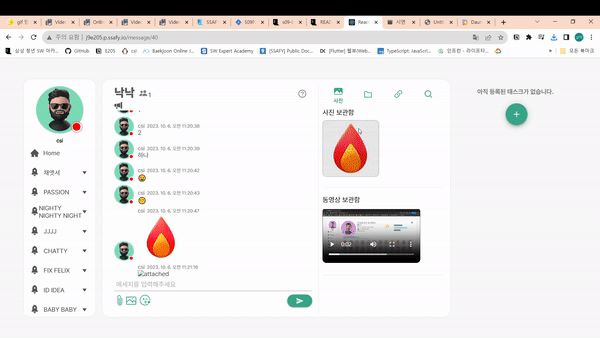

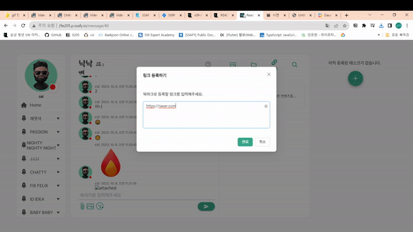

- 개인 태스크 생성/ 수정

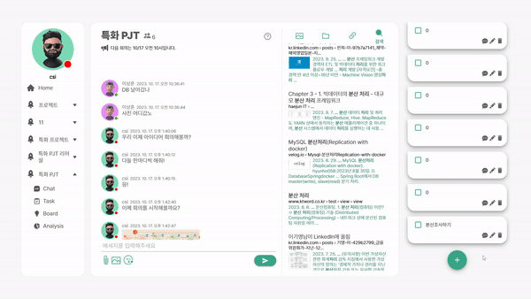

- 개인 태스크 삭제


- 채팅 > 개인 태스크 등록

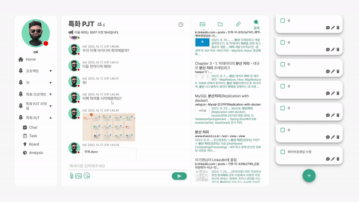

- 채팅 > 개인 태스크 생성

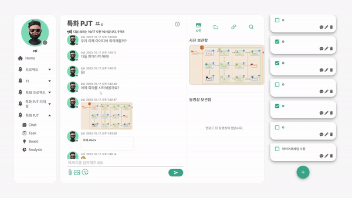

### 5. Task

- 공통태스크 등록

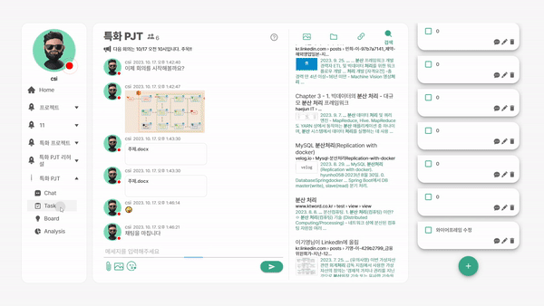

- 개인 태스크 > 공통 태스크 등록

### 6. Board

- 마인드맵 생성 및 삭제

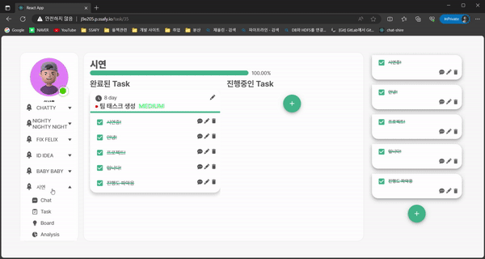

- 에러 게시판 작성

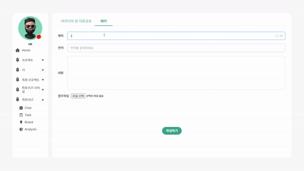

- 에러 댓글 작성

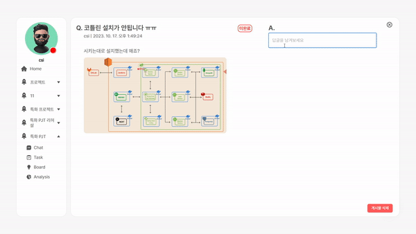

- 에러 댓글 채택 

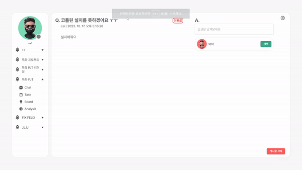

- 에러 게시판 검색

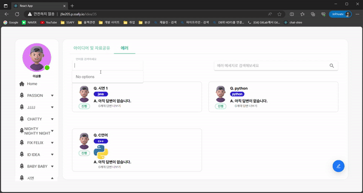

### 7. Analysis

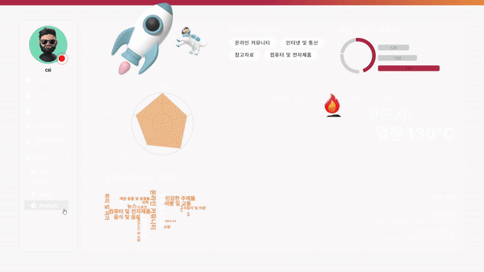

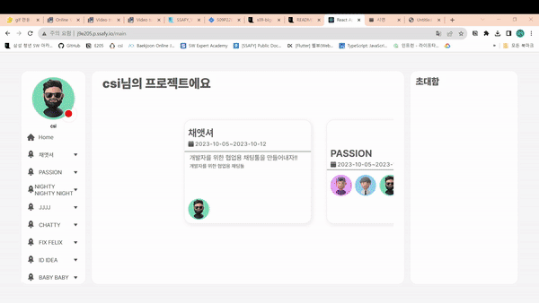

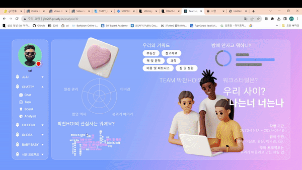

## 

## 느낀 점
