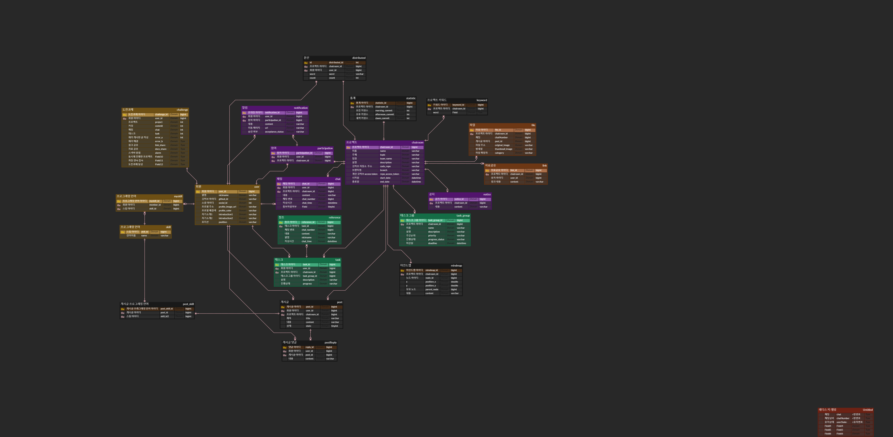

<h1 align="center"> E205 특화 프로젝트 </h1>

## 📝 목차

[프로젝트 개요](#item-one)

[역할 분담](#item-two)

[기술 스택](#item-three)

[데이터 베이스 모델링 (ERD)](#item-four)

[서비스 구현 화면](#item-five)

[느낀 점](#item-end)

## 프로젝트 개요

# 프로젝트 확인하기

## 역할 분담

 

## 기술 스택

## **⚙** Management Tool

## 💻 IDE

## 📱 Frontend

## 💾 Backend

## 🔃 DevOPS

## 데이터 베이스 모델링 (ERD)

## 프로젝트 구조도

## 서비스 구현 화면

## 느낀 점

